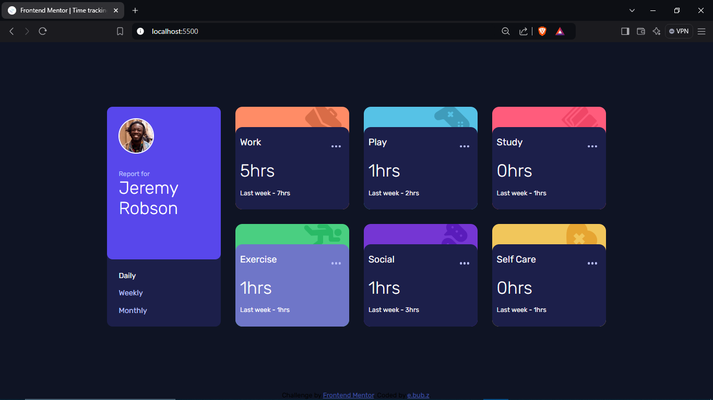
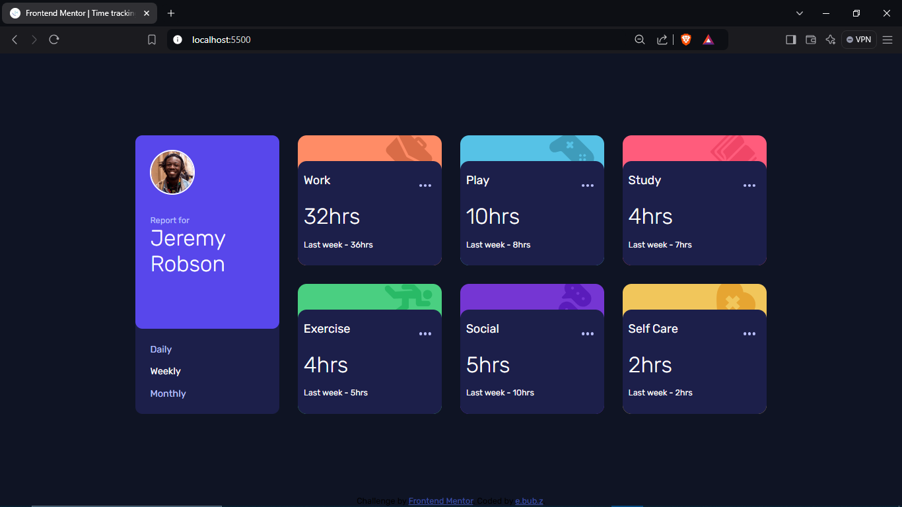
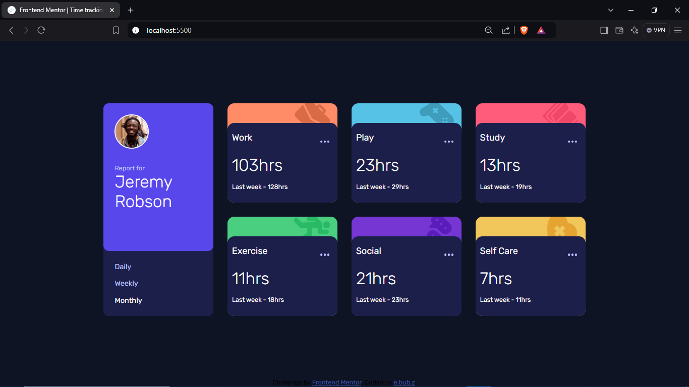

# Frontend Mentor - Time tracking dashboard solution

This is a solution to the [Time tracking dashboard challenge on Frontend Mentor](https://www.frontendmentor.io/challenges/time-tracking-dashboard-UIQ7167Jw). Frontend Mentor challenges help you improve your coding skills by building realistic projects. 

## Table of contents

  - [The challenge](#the-challenge)
  - [Screenshot](#screenshot)
  - [Links](#links)
- [Author](#author)

### The challenge

Users should be able to:

- View the optimal layout for the site depending on their device's screen size
- See hover states for all interactive elements on the page
- Switch between viewing Daily, Weekly, and Monthly stats

### Screenshot

### Links

- Solution URL: [https://github.com/ebubz-dev/time-tracking-dashboard](https://github.com/ebubz-dev/time-tracking-dashboard)
- Live Site URL: [https://ebubz-dev.github.io/time-tracking-dashboard/](https://ebubz-dev.github.io/time-tracking-dashboard/)

## My process

### Built with

- Semantic HTML5 markup
- CSS custom properties
- Flexbox
- CSS Grid

## Author

- Website - [e.bub.z](https://ebubz-dev.github.io)
- Frontend Mentor - [@ebubz-dev](https://www.frontendmentor.io/profile/ebubz-dev)